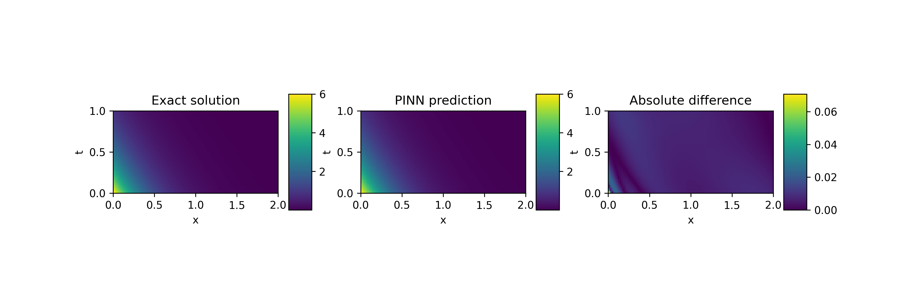

# PINN Demo
Simple Demonstration notebook for Physics-informed neural networks (PINNs)

## Problem Statement
We consider the following partial differential equation (PDE)
$$ \frac{\partial u}{\partial x} = 2\frac{\partial u}{\partial t} + u $$
with boundary condition
$$ u(x,0) = 6e^{-3x}.$$

The variables are:
* $x,t$ for the input
* $u$ for the output

**Goal:** We are searching for $u(x,t)$ for all $x$ in range $[0,2]$ and $t$ in range $[0,1]$.

The obtained result looks like this:



## Introduction
Clone this repository to your local machine and open the notebook in Jupyter Lab.
```bash
    git clone https://github.com/nperraud/pinn-demo.git
    cd pinn-demo
```


## Requirements
To install the required packages, run the following command in the terminal:

```bash
    pip install torch numpy matplotlib jupyterlab pytorch-lightning
```

Alternatively, you can use `poetry` to install the dependencies:

```bash
    poetry shell
    poetry install
```

## Running the notebook
To run the notebook, run the following command in the terminal:

```bash
    jupyter lab
```

